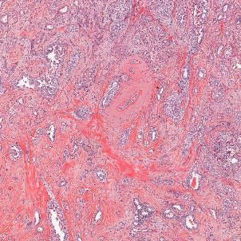
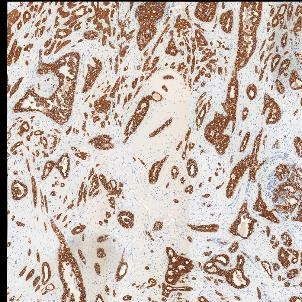
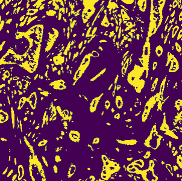

# General presentation

## Context

With the development of Machine Learning (ML) and Deep Learning (DL) techniques, digital pathology has been growing exponentially in recent years. In particular, automated analysis of digitized tissue slides shows promise for diagnostic assistance. There are at the moment two main categories of research when it comes to histological image analysis:
* automated diagnosis/prognosis, which given an input image aims at directly outputting an answer to a specific clinical question;
* automated segmentation, which aims at detecting meaningful biological structures on the input image.

Both present significant challenges that currently limit the perspectives of seeing actual clinical use of these techniques. For automated diagnosis/prognosis, the statistical nature of ML coupled with the black box construction of DL make it very hard to trust such tools. It is very hard to prove that a deep learning model doesn't make its predictions based on biased information. At the core of this lack of understanding is the semantic gap: DL models and pathologists don't "speak the same language". This means that whatever the prediction they do, they cannot explain it to one another. As for segmentation, it is more visual and therefore causes less problems when it comes to identifying bias. However, most segmentation tasks suffer from a significant lack of annotations, as it requires a lot of expert work to annotate biological structures.

## Goals of the project

This project aims at covering the main weaknesses of both automated diagnosis and segmentation, by creating a large annotated dataset for the segmentation of multiple biological structures, which can then serve as a basis to perform explainable diagnosis using features extracted from these structures. To that end, we make use of immunohistochemistry (IHC), a technique used in day-to-day diagnosis that highlights specific proteins on tissue slides. This can be used to detect certain mutations to obtain a finer diagnosis, but also to isolate specific biological structures. We selected 9 markers that highlight biological elements that pathologists use to make their diagnosis:

* AE1AE3: epithelial cells' cytoplasms
* CD163: tumor associated macrophages
* CD3/CD20: T and B lymphocytes
* EMD: nuclear membranes
* ERG/Caldesmone: blood vessels
* ERG/Podoplanine: lymphatic vessels
* INI1: cell nuclei
* P40/ColIV: basal membranes
* PHH3: cell mitosis

With these markers, we produced paired images, one using standard Hematoxyilin and Eosin (H&E) staining, one being restained using an IHC technique. On the IHC slide, tissue is marked using DAB stain which appears in brown (coupled with a red stain for double markers). This makes it easy to extract binary segmentation masks from these IHC with a simple threshold on DAB values. However, these masks do not directly fit the corresponding H&E slide as the use of IHC on the tissue slide and the following scan can create deformations. It is therefore needed to register the IHC image with the corresponding H&E in order to have an exact pairing between H&E image and segmentation mask.

 |  | 
:---: | :---: | :---:
Original H&E image | Registered IHC (AE1AE3) image | Extracted mask

Once all H&E/masks pairs are created, they form multiple binary segmentation datasets (one for each IHC technique) which can then be used to train supervised DL models. These models should be able to detect the biological structures marked by the corresponding IHC so that it is no longer needed in future work. Knowing that these structures are the baseline for a pathologist's diagnosis, it is probable that extracting features from them to feed into explainable ML algorithms (like XGBoost) should provide us with reliable and transparent predictions.
